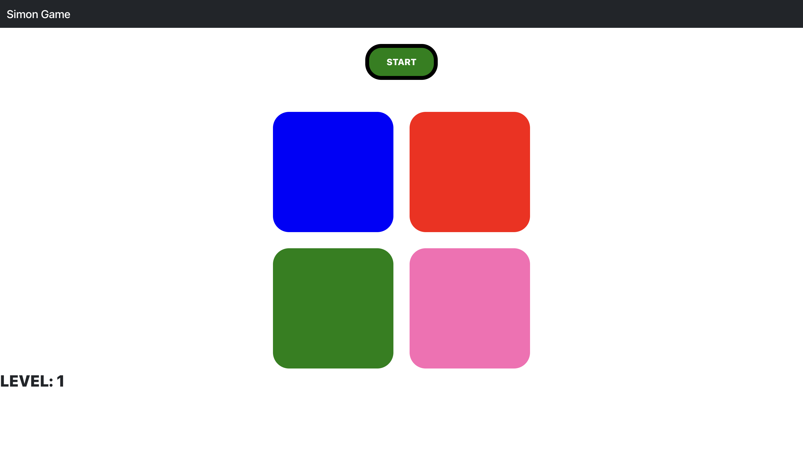
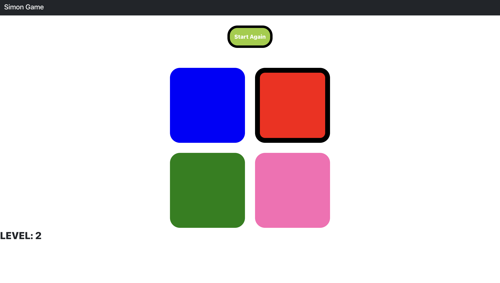
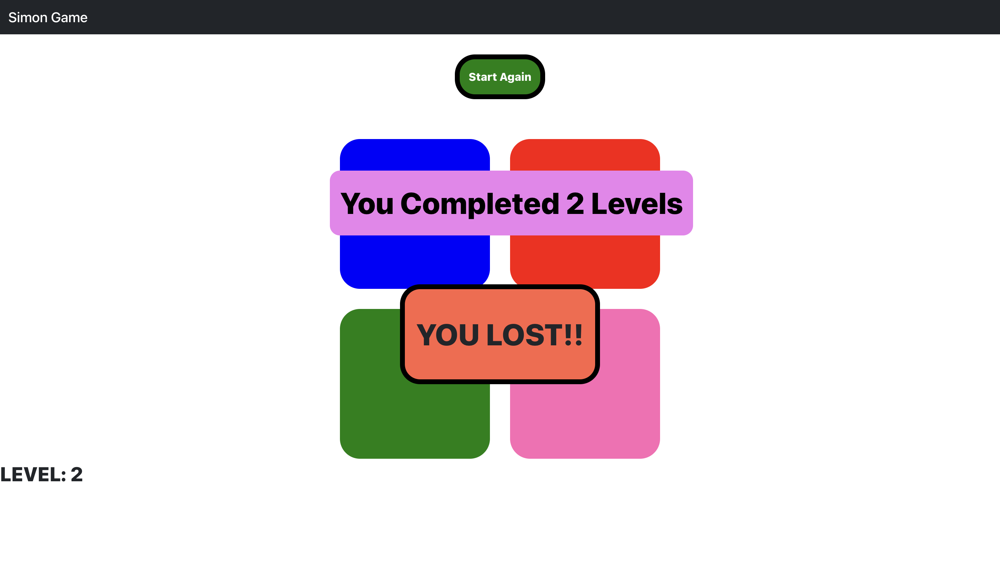
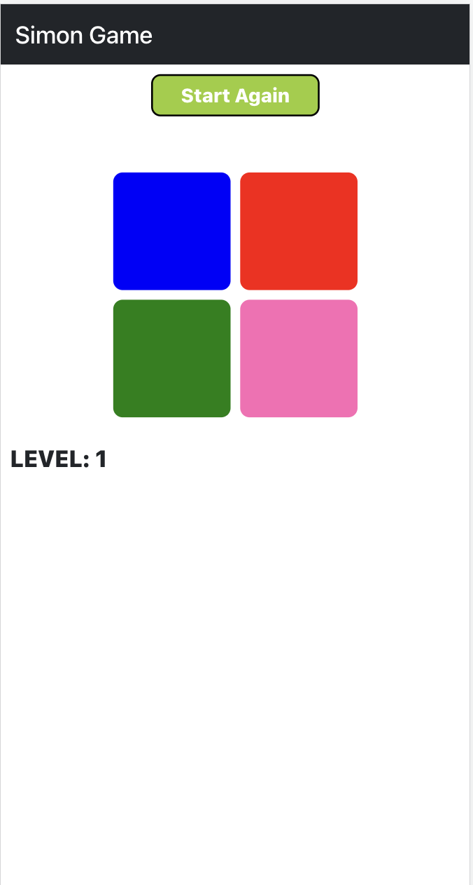
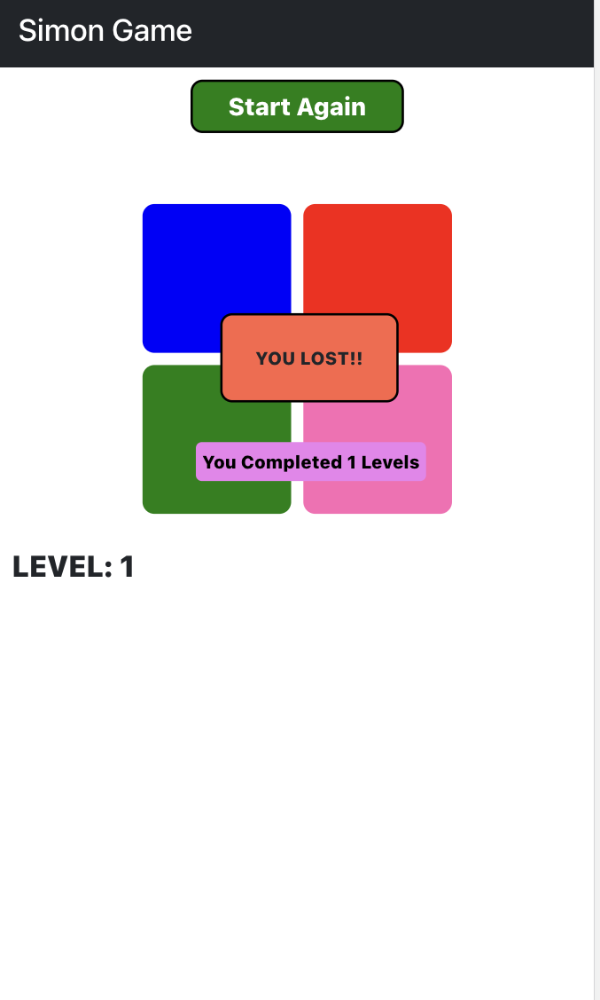

# Flow of readme file
1)video link of working website 
2)images desktop 
3)images small device 
4)about react

<a href="https://drive.google.com/file/d/1fVQlMwTLbUu3t_-sABR96lCYlN_p4ZZG/view?usp=sharing"><h3>Working Website Video Link</h3></a>

# images desktop

    
   
   

# images small device

    
   

# Getting Started with Create React App

This project was bootstrapped with [Create React App](https://github.com/facebook/create-react-app).

## Available Scripts

In the project directory, you can run:

### `npm start`

Runs the app in the development mode.\
Open [http://localhost:3000](http://localhost:3000) to view it in your browser.
